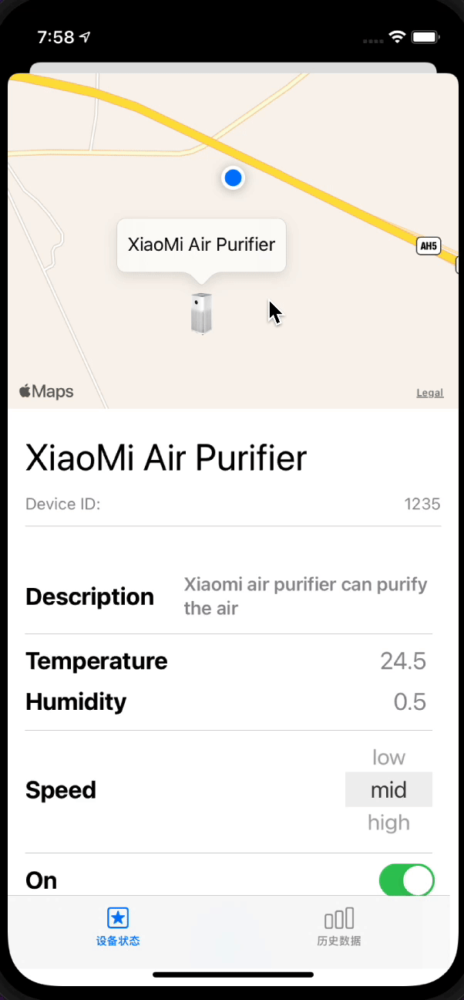
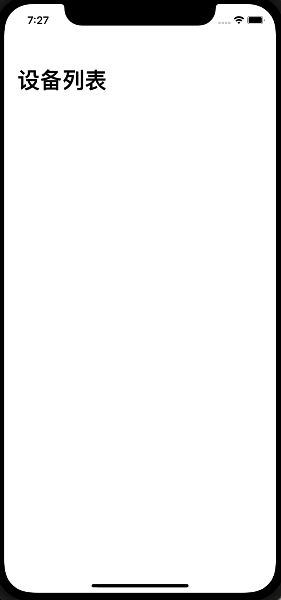

# UDO-iOS-Client

## TODO：

- 添加TabItem: Applications展示目前设备所处的上下文，点进上下文中，展示这个上下文中的资源
- 修改Devices为Resources，展示目前所有的资源
- 修改通信协议，设备支持进入多个上下文
- 添加任务上传

## 信息格式约定

- 修改发送到信息的格式： 

  ```
  {
    source: "",
    destination: "",
    context: "",
    category: "",
    payload: {
      ...
    }
  }
  ```

  - 其中`source`指定发送者的uri，`destination`指定这个信息作用的对象，可以是具体的uri，也可以是all，代表广播。对于后端发出的信息来说，较为特殊，`source`应该为`backend`。如果是一条广播信息，`destination`为all。
  - `payload`就是之前约定的一个udo对象的状态。
  - `context`指定了这个消息所在的上下文，对于尚未加入某个上下文的人的资源，值为空字符串。
  - `category`取值为 update或者delete，表示这个信息是更新还是删除。删除应当只出现在后端广播将某个资源移出当前上下文的情况下。

- 流程：

  - Register： 人向 `topic/register`里发送信息，向后端表明身份。因为人此时未注册，所以`context`为空，发出的信息格式类似于：

    ``` 
    {
      source: "test@udo.com",
      destination: "test@udo.com",
      context: "",
      category: "update",
      payload: {
        # uri, avatarUrl, location等信息
      }
    }
    ```

  - Enter context： `backend`向`topic/register`中发送信息，指定将某个人加入到某个上下文中：

    ```
    {
      source: "backend",
      destination: "test@udo.com",
      context: "office-409",
      category: "update",
      payload: {
        # uri, avatarUrl, location等信息，这里可以不填，因为人只需要知道自己新的上下文是什么
      }
    }
    ```

    之后人会以一定周期向`topic/office-409`中发送更新自己的状态的信息：

    ``` 
    {
      source: "test@udo.com",
      destination: "test@udo.com",
      context: "office-409",
      category: "update",
      payload: {
        # uri, avatarUrl, location等信息
      }
    }
    ```

    人可以同时处于多个上下文中，如果要将某个人移除某个上下文，那么消息的格式和加入上下文一样，只是把update改成delete。

  - Add device： 假定在上下文`office-409`中已经有了多个人，此时后端希望加入一个空气净化器，那么需要在`topic/office-409`中publish这样的信息

    ``` 
    {
      source: "backend",
      destination: "all",
      context: "office-409",
      category: "upadte",
      payload: {
        # 之前约定的设备信息格式
      }
    }
    ```

    人会判定这个消息是由后端广播的，然后会解析payload，并展示这个设备。

  - Update device： 人可以对设备进行修改，通过在`topic/office-409`中发送这样的信息：

    ```
    {
      source: "test@udo.com",
      destination: "123456", # 设备uri
      context: "office-409",
      category: "upadte",
      payload: {
        # 之前约定的设备信息格式
      }
    }
    ```

    后端根据desination可以知道要修改的设备的uri。后端在收到消息之后根据规则链对消息来进行过滤，无论是否通过，后端都要广播设备之后的状态。

  - Delete device: 后端可以将某个设备移出当前上下文，只需要向`topic/office-409`广播这样的信息：

    ``` 
    {
      source: "backend",
      destination: "all",
      context: "office-409",
      category: "delete",
      payload: {
        # 之前约定的设备信息格式
      }
    }
    ```

    人会收到这个信息，并根据category和payload中的uri来删除自己这边的设备。

  

## Test

1. Open the project. Build and run the app in simulator
2. Run commands below in terminal

``` shell
$ pip install paho-mqtt==1.5.1
$ python test_publisher.py -h
```




