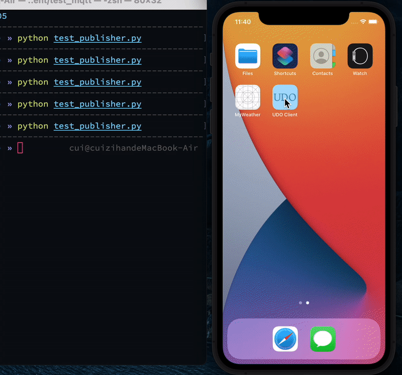

# UDO-iOS-Client

## test

1. Install dependency
``` shell
$ pod install
```

2. Open `UDO Client.xcworkspace`, build and run the  XCode Project


3. Run commands below in terminal

``` shell
$ pip install paho-mqtt==1.5.1
$ python test_publisher.py
```




## 问题

应用在后台无法接受MQTT，需要将MQTT的接受从ViewController转移到专用的后台任务