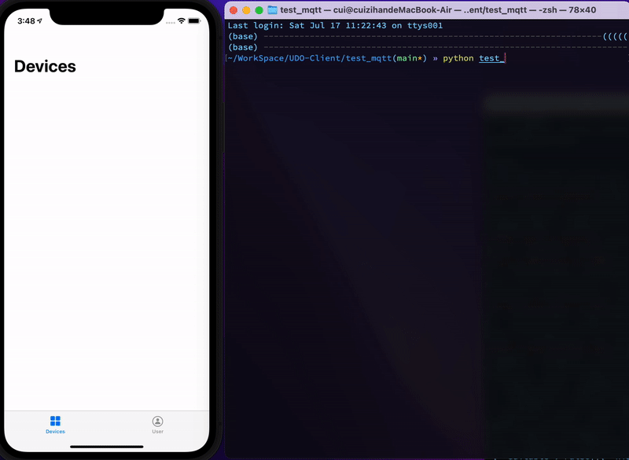

# UDO-iOS-Client

## TODO

- 将MQTT服务部署到新的服务器上
- 修改发送到信息的格式： {Header: ..., Body:...}
- 在Header里增加update还是delete的字段，根据行为来进行操作
- 添加演示的界面

## Test

1. Open the project. Build and run the app in simulator
2. Run commands below in terminal

``` shell
$ pip install paho-mqtt==1.5.1
$ python test_publisher.py
```




